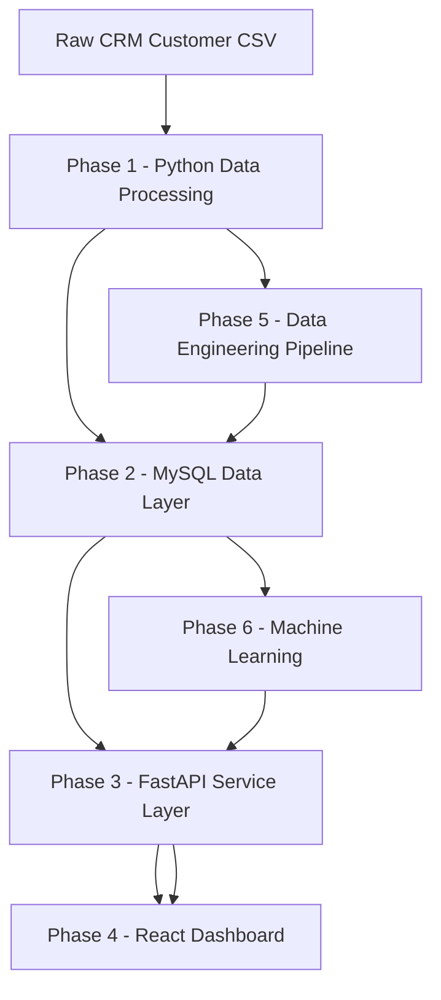
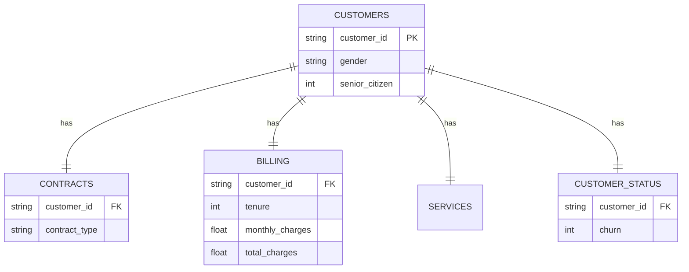

# 📊 Customer Churn Intelligence System

# 📞 Telecom Customer Churn Prediction & Retention Intelligence Platform

### Python • MySQL • FastAPI • React • PySpark • Machine Learning

An end-to-end telecom analytics solution designed to transform customer data into meaningful churn insights, automated data workflows, interactive analytics, and machine-learning-driven churn predictions.

</div>

---

# 🚀 Project Overview

Customer churn directly affects the revenue, growth, and long-term customer relationships of telecom organizations. Identifying customers who may leave the service early allows retention teams to take preventive action before churn actually occurs.

The **Customer Churn Intelligence System** is an end-to-end analytics and machine learning project developed using the **IBM Telco Customer Churn Dataset**.

The project processes raw telecom customer information through multiple layers, including:

- Data profiling and cleaning
- Feature engineering
- Relational database management
- REST API development
- Interactive dashboard development
- Data engineering pipelines
- Machine learning
- Real-time churn risk prediction

The goal is not simply to train a churn model. The project demonstrates how a complete data-driven application can take raw customer records and convert them into actionable retention intelligence.

## 🎯 Business Objectives

The system is designed to:

✅ Detect customers with a higher probability of leaving the service

✅ Identify the major factors associated with customer churn

✅ Provide useful customer-retention insights to business teams

✅ Automate customer data preparation and feature engineering

✅ Build a centralized database for customer analytics

✅ Expose analytics and prediction functionality through REST APIs

✅ Provide real-time churn predictions using machine learning

✅ Present customer and churn information through an interactive dashboard

---

# 📌 Dataset Overview

The project uses the **IBM Telco Customer Churn Dataset**, which contains demographic, subscription, service, billing, and churn information for telecom customers.

| Metric | Value |
|---|---|
| Dataset | IBM Telco Customer Churn |
| Total Records | 7,043 |
| Features | 21 |
| Target Variable | Churn |
| Active Customers | 73.5% |
| Churned Customers | 26.5% |
| Missing `TotalCharges` Values | 11 |

The target variable indicates whether a customer remained with the telecom provider or discontinued the service.

---

# 🏗️ System Architecture

The project is divided into six major phases, with each phase responsible for a specific part of the customer intelligence workflow.



### Architecture Flow

**Phase 1** prepares and analyzes the customer dataset.

**Phase 2** stores structured customer information inside MySQL.

**Phase 3** exposes customer, analytics, and machine learning functionality through FastAPI.

**Phase 4** provides a user-facing React dashboard.

**Phase 5** introduces automated and scalable data engineering workflows.

**Phase 6** trains and deploys the churn prediction model.

---

# 🔄 End-to-End Data Flow

The complete project follows the following data lifecycle:

```text
Raw Telecom Customer Data
          │
          ▼
Data Profiling & Cleaning
          │
          ▼
Feature Engineering
          │
          ▼
MySQL Database
          │
          ▼
FastAPI Service Layer
          │
     ┌────┴────┐
     ▼         ▼
 React UI   ML Model
     │         │
     └────┬────┘
          ▼
 Customer Churn Intelligence
          │
          ▼
 Real-Time Churn Prediction
```

Raw customer information is first validated and transformed into a cleaner analytical format. The processed data is then stored inside MySQL and made available to both application services and the machine learning layer.

FastAPI acts as the communication layer between the database, machine learning model, and React dashboard.

---

# 📂 Project Structure

```text
Customer_Churn_Project/
│
├── database/
│   ├── models.py
│   ├── connection.py
│   └── security.py
│
├── routers/
│   ├── customers.py
│   ├── analytics.py
│   └── prediction.py
│
├── services/
│   └── churn_service.py
│
├── schemas/
│   └── pydantic_models.py
│
├── phase1/
│   ├── customer_cleaner.py
│   ├── profiling.py
│   ├── feature_engineering.py
│   └── pipeline.py
│
├── phase5/
│   ├── ingestion.py
│   ├── cleaning_stage.py
│   ├── feature_pipeline.py
│   ├── quality_checks.py
│   ├── pyspark_processing.py
│   └── incremental_load.py
│
├── phase6/
│   ├── train_model.py
│   ├── predict.py
│   ├── scoring_job.py
│   └── models/
│
├── sql/
│   ├── SQL1_schema.sql
│   ├── SQL2_staging.sql
│   ├── SQL3_curated.sql
│   ├── SQL4_analytics.sql
│   ├── SQL5_ml_features.sql
│   └── SQL6_high_risk_view.sql
│
├── react-app/
│
├── docs/
│
├── main.py
├── requirements.txt
├── customer_churn.csv
└── README.md
```

The codebase is organized by responsibility so that data processing, APIs, database functionality, machine learning, and frontend development can be maintained independently.

---

# 🧹 Phase 1 — Python Data Processing & Analytics

Phase 1 establishes the foundation of the project.

The raw customer dataset is inspected, cleaned, standardized, and transformed before it is used by downstream systems.

## CustomerCleaner

A reusable `CustomerCleaner` component handles the major data-cleaning operations.

```python
cleaned_df = (
    CustomerCleaner(raw_df)
    .standardize_column_names()
    .fix_total_charges()
    .normalize_binary_columns()
    .handle_nulls()
    .clean()
)
```

Using a reusable cleaner keeps the transformation logic consistent whenever new customer data enters the system.

## Main Responsibilities

The Phase 1 processing layer performs:

- Column-name standardization
- Data-type correction
- `TotalCharges` conversion
- Missing-value handling
- Binary-value normalization
- Customer data validation
- Feature preparation
- Creation of machine-learning-ready datasets

---

# 📊 Exploratory Business Insights

Exploratory analysis is used to understand which customer groups experience the highest churn rates.

## Churn by Contract Type

| Contract Type | Churn Rate |
|---|---:|
| Month-to-Month | 42.71% |
| One Year | 11.27% |
| Two Year | 2.83% |

The analysis indicates a strong relationship between contract duration and customer retention.

Customers using long-term contracts demonstrate substantially lower churn compared with customers using month-to-month agreements.

## Churn by Internet Service

| Internet Service | Churn Rate |
|---|---:|
| Fiber Optic | 41.89% |
| DSL | 18.96% |
| No Internet | 7.40% |

Fiber-optic customers show a considerably higher churn rate in this dataset.

## 🔎 Key Observation

> Customers using month-to-month contracts form one of the most important churn-risk groups identified during the analysis.

This information can help retention teams prioritize customer segments that may require additional attention.

---

# 🗄️ Phase 2 — MySQL Database Layer

Phase 2 moves the project from file-based processing into a structured relational database.

Instead of allowing every system component to directly read the original CSV file, customer information is organized into database tables that can be queried by APIs, analytics jobs, dashboards, and machine learning processes.

## Database Design



The database separates customer information into logical business entities while connecting each table using the customer identifier.

## Core Tables

The primary tables used by the system include:

- `customers`
- `contracts`
- `billing`
- `services`
- `customer_status`
- `stg_customer_raw`
- `cleaned_customers`
- `customer_ml_features`

### Data Layer Design

The database workflow can be viewed as three logical areas:

```text
Raw / Staging Data
        ↓
Cleaned & Curated Customer Data
        ↓
Analytics & ML Feature Data
```

This structure makes it easier to maintain data quality while keeping raw, transformed, and model-ready information separate.

---

# 🌐 Phase 3 — FastAPI Backend

Phase 3 introduces the backend service layer.

FastAPI allows the frontend application and other systems to access customer data without directly connecting to the MySQL database.

The API provides functionality for:

- Customer lookup
- Customer profile retrieval
- Churn analytics
- High-risk customer identification
- Machine learning feature retrieval
- Churn prediction

---

# 🔌 REST API Endpoints

## Customer APIs

Retrieve information for an individual customer:

```http
GET /customers/{id}
```

Retrieve a more detailed customer profile:

```http
GET /customers/{id}/profile
```

Search for customers:

```http
GET /customers/search
```

---

## Analytics APIs

Retrieve customers considered at higher churn risk:

```http
GET /customers/high-risk
```

Retrieve overall churn statistics:

```http
GET /churn/summary
```

---

## Machine Learning APIs

Retrieve model features associated with a customer:

```http
GET /features/{id}
```

Generate a churn prediction:

```http
POST /predict-churn
```

---

# 🤖 Example Churn Prediction

## Request

```json
{
  "tenure": 8,
  "monthly_charges": 95.5,
  "contract_type": "Month-to-month",
  "service_count": 5
}
```

## Response

```json
{
  "risk_score": 0.84,
  "confidence": 0.81,
  "prediction": "Likely to Churn"
}
```

The prediction service converts the incoming customer information into the format expected by the trained machine learning model and returns the calculated churn risk to the calling application.

---

# 🖥️ Phase 4 — React Dashboard

Phase 4 provides the visual interface for interacting with the churn intelligence system.

Rather than requiring business users to manually execute database queries or call API endpoints, the dashboard exposes the most important information through a browser-based application.

## Dashboard Modules

### 🔍 Customer Search

Allows users to search for individual customer records and retrieve customer information stored in the database.

### 📈 Churn Summary

Provides an executive-level overview of important churn KPIs, including:

- Total Customers
- Active Customers
- Churned Customers
- Overall Churn Rate

This module gives users a quick understanding of the current customer-retention situation.

### ⚠️ High-Risk Customers

Displays customers who may require retention attention.

Information shown can include:

- Customer ID
- Customer tenure
- Monthly charges
- Churn risk
- Important risk indicators

The purpose of this view is to convert model and analytics results into something that retention teams can easily use.

### 🤖 Churn Predictor

Provides an interactive interface connected to the trained machine learning model.

Users can provide customer attributes and obtain a churn prediction without manually executing machine learning code.

---

# ⚙️ Phase 5 — Data Engineering Pipeline

Phase 5 converts individual data-processing scripts into a structured data pipeline.

The objective is to make ingestion, transformation, validation, and feature generation repeatable instead of manually processing the dataset each time.

## Pipeline Workflow


The pipeline starts when customer information enters the landing area and finishes when validated, transformed, and scored information becomes available to the application.

---

# 🧩 Pipeline Capabilities

The data engineering layer supports:

✅ Automated data ingestion

✅ Schema validation

✅ Reusable cleaning processes

✅ Data quality validation

✅ Incremental data processing

✅ Customer feature generation

✅ Processing logs and audit information

✅ PySpark-based data processing

✅ Machine-learning-ready datasets

These capabilities help make the system more repeatable, scalable, and production-oriented.

---

# ⚡ PySpark Processing

PySpark is included in the project to demonstrate how customer processing can be adapted for larger datasets.

While the IBM churn dataset itself is relatively small, the PySpark pipeline represents how similar transformations could be executed when working with much larger telecom customer datasets.

Typical Spark processing responsibilities include:

```text
Read Customer Data
        ↓
Apply Schema
        ↓
Clean Records
        ↓
Transform Fields
        ↓
Generate Features
        ↓
Validate Output
        ↓
Write Processed Data
```

This allows the project to demonstrate both traditional Python processing and distributed data engineering concepts.

---

# 🤖 Phase 6 — Machine Learning

Phase 6 introduces predictive churn intelligence.

Instead of only describing customers who already churned, machine learning attempts to identify patterns associated with churn and estimate the probability that a customer may leave.

The model uses customer characteristics such as:

- Contract type
- Customer tenure
- Monthly charges
- Services
- Billing information
- Other engineered customer attributes

---

# 🧪 Models Evaluated

Two classification models were evaluated during the project.

| Model | Accuracy | Precision | Recall | F1 Score |
|---|---:|---:|---:|---:|
| Logistic Regression | 78.5% | 0.62 | 0.49 | 0.548 |
| Decision Tree | 77.6% | 0.61 | 0.43 | 0.507 |

The comparison considers more than accuracy because churn prediction involves an imbalanced target distribution.

Precision, recall, and F1 score provide additional information about how effectively the models identify churn customers.

---

# 🏆 Selected Machine Learning Model

The selected model is:

## Logistic Regression

Logistic Regression produced the stronger overall result among the evaluated models and was selected for integration into the churn prediction workflow.

### Cross-Validated F1 Score

```text
0.5602
```

Cross-validation provides a better indication of model consistency by evaluating performance across multiple subsets of the available training data.

---

# 🔎 Major Churn Drivers

The analysis identified several customer attributes that are strongly associated with churn.

### 🥇 Month-to-Month Contract

Customers without a long-term contract represent the strongest churn-risk group identified in the project.

### 🥈 Monthly Charges

Higher monthly costs are another important characteristic associated with customer churn.

### 🥉 Customer Tenure

Customers with shorter relationships with the telecom provider are generally more vulnerable to churn.

Together, these variables provide useful information for both machine learning predictions and business retention strategies.

---

# 📊 Key Project Findings

## Churn Rate by Important Customer Segments

| Customer Segment | Churn Rate |
|---|---:|
| Month-to-Month Contract | 42.71% |
| One Year Contract | 11.27% |
| Two Year Contract | 2.83% |
| Fiber Optic | 41.89% |
| Electronic Check | 45.29% |

These results show that churn is not evenly distributed across the customer population.

Certain combinations of contract, service, billing, and tenure characteristics represent considerably higher risk.

---

# ⚠️ High-Risk Customer Segment

One particularly important customer pattern identified during the analysis is:

```text
Month-to-Month Contract
          +
Tenure < 12 Months
          +
Above-Average Monthly Charges
```

Customers matching these characteristics are valuable candidates for retention analysis.

## Identified Customers

```text
299 Customers
4.25% of Customer Base
```

Instead of treating every customer equally, this segmentation enables retention teams to concentrate resources on a smaller and more relevant customer population.

---

# 💼 Business Value

The project demonstrates how churn analytics can be transformed from a standalone machine learning exercise into an operational customer-retention system.

### Without the Platform

```text
Customer Data
      ↓
Manual Analysis
      ↓
Churn Happens
      ↓
Customer Is Lost
```

### With the Platform

```text
Customer Data
      ↓
Automated Processing
      ↓
Customer Features
      ↓
Risk Prediction
      ↓
High-Risk Customer Identification
      ↓
Retention Action
```

The system helps shift the business approach from **reacting to churn** toward **identifying churn risk earlier**.

---

# 🔗 Component Integration

The individual phases are connected instead of functioning as isolated exercises.

```text
              ┌────────────────────┐
              │ Raw Customer Data  │
              └─────────┬──────────┘
                        │
                        ▼
              ┌────────────────────┐
              │ Python Processing  │
              └─────────┬──────────┘
                        │
                 ┌──────┴──────┐
                 ▼             ▼
          Data Pipeline    Feature Engineering
                 │             │
                 └──────┬──────┘
                        ▼
              ┌────────────────────┐
              │   MySQL Database   │
              └─────────┬──────────┘
                        │
              ┌─────────┴──────────┐
              ▼                    ▼
        FastAPI Backend        ML Training
              │                    │
              └─────────┬──────────┘
                        ▼
               Prediction Service
                        │
                        ▼
                React Dashboard
```

This integration is one of the main objectives of the project.

The final solution combines **data engineering, backend development, frontend development, analytics, database engineering, and machine learning** into one connected workflow.

---

# 🛠️ Installation

## 1. Clone the Repository

```bash
git clone https://github.com/yourusername/customer-churn.git
```

Move into the project directory:

```bash
cd customer-churn
```

---

## 2. Create a Python Virtual Environment

```bash
python -m venv venv
```

---

## 3. Activate the Environment

### Windows

```bash
venv\Scripts\activate
```

### Linux / macOS

```bash
source venv/bin/activate
```

---

## 4. Install Python Dependencies

```bash
pip install -r requirements.txt
```

---

# 🚀 Running the Application

## Start the FastAPI Backend

```bash
uvicorn main:app --reload
```

The FastAPI development server will start and expose the application endpoints.

FastAPI automatically provides interactive API documentation through Swagger UI.

---

# 🖥️ Start the React Frontend

Move to the React application directory:

```bash
cd react-app
```

Install frontend dependencies:

```bash
npm install
```

Start the development server:

```bash
npm run dev
```

The React application can then communicate with the FastAPI backend to retrieve customer information, analytics, and churn predictions.

---

# 🔐 API Authentication

The API uses an API-key-based authentication mechanism.

Protected requests require the following header:

```http
X-API-Key
```

Example:

```http
X-API-Key: your_api_key
```

The API key helps prevent unauthorized users from directly accessing protected application endpoints.

---

# 🧰 Technology Stack

| Area | Technology |
|---|---|
| Programming | Python |
| Data Processing | Pandas |
| Distributed Processing | PySpark |
| Database | MySQL |
| Backend API | FastAPI |
| API Validation | Pydantic |
| Frontend | React |
| Machine Learning | Scikit-learn |
| Model Type | Logistic Regression |
| Data Format | CSV |
| API Communication | REST / JSON |

---

# 🌟 Project Highlights

This project demonstrates several important software, data engineering, and machine learning concepts within a single solution.

### Data Engineering

- Raw data ingestion
- Schema validation
- Data cleaning
- Incremental processing
- Quality checks
- Feature pipelines
- PySpark processing

### Database Engineering

- Relational database design
- Staging tables
- Curated datasets
- Customer analytics tables
- Machine learning feature tables

### Backend Development

- REST APIs
- Pydantic validation
- API authentication
- Database integration
- Prediction endpoints

### Frontend Development

- React-based dashboard
- Customer search
- KPI reporting
- High-risk customer analysis
- Interactive churn prediction

### Machine Learning

- Feature engineering
- Model training
- Model comparison
- Cross-validation
- Churn classification
- Prediction serving

---

# 🎯 Future Enhancements

The platform can be extended with additional production-oriented capabilities.

Possible improvements include:

- Apache Airflow workflow orchestration
- Docker containerization
- CI/CD deployment pipelines
- SHAP-based model explainability
- Automated model retraining
- Kubernetes deployment
- Application monitoring
- Data pipeline alerting
- Model performance monitoring
- Feature-store implementation

These additions could move the platform closer to a complete production-level machine learning and data engineering architecture.

---

# 👨‍💻 Author

**Mohammed Marzook Lathief N M**

Trainee

**Customer Churn Intelligence System**

---

# ⭐ Final Project Outcome

The completed project demonstrates the complete movement of telecom customer information through multiple technology layers.

```text
Raw Customer Data
        ↓
Data Profiling
        ↓
Data Cleaning
        ↓
Feature Engineering
        ↓
Data Engineering Pipeline
        ↓
MySQL Database
        ↓
FastAPI Backend
        ↓
React Dashboard
        ↓
Machine Learning
        ↓
Churn Risk Prediction
        ↓
Retention Intelligence
```

The result is an **end-to-end Customer Churn Intelligence Platform** that brings together data processing, data engineering, relational databases, APIs, frontend development, analytics, and machine learning.

Rather than building only a prediction model, the project demonstrates how a churn model can become part of a complete application where customer information is continuously transformed into useful business intelligence.

---

### 📊 From Raw Customer Data to Actionable Retention Intelligence

**Data Engineering • Analytics • Full Stack Development • Machine Learning**
